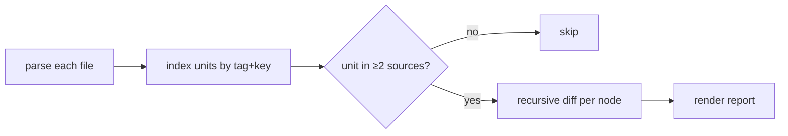

# How it works

`xmldiffreport` treats every XML document as a tree of nodes and compares **N**
of them at once, aligning nodes by a **natural key** rather than by position.

## The model

- Each element is a node with **attributes**, optional **text**, and **children**.
- A **recipe** declares, per tag: the `key` (natural identity), whether the tag
  is `inline` (its children become pseudo-attributes instead of opening a new
  level), and which attributes to ignore.
- The engine compares **N sources** simultaneously, matching nodes by identity
  (order-independent). **Only differences** end up in the result.

## Units and recursion

The recipe's `unit` (e.g. `SMART_FOLDER`) is the top comparison entity. For each
unit present in **2 or more sources**, the engine walks the tree recursively:

- **Scalar differences** — attributes (and element text) that differ become rows.
- **Leaf / inline children** (e.g. `INCOND`, `OUTCOND`, `ON`) are compared by
  their key; a row appears when one is added/removed or when one of its
  **attributes** changes (e.g. an `OUTCOND` keeps its `NAME` but flips `SIGN`).
- **Container children** (e.g. `JOB`) open a new level and are rendered as
  sub-sections; identical ones are collapsed into a count.

## Attribute-level, not just present/absent

Because elements are matched by identity, a change *inside* an element is shown
as an attribute change, not as a delete + add:

|   | Element / attribute | bench | uat | prod |
|:-:|---|---|---|---|
| ≠ | INCOND `…STAGE-…LOAD_OK` · `AND_OR` | `A` | **`O`** | `A` |
| ≠ | OUTCOND `…LOAD-…POST_OK` · `SIGN` | **`-`** | `+` | `+` |

## Reading the report

The Markdown and HTML reports share one structure:

- A top **Sources** block maps each short environment label — the parent
  directory, e.g. `bench` — to its full file path, listed once. The tables then
  use the short labels as columns so they stay narrow.
- The **Summary** has one column per change type — **Own** (the unit's own
  attribute/text diffs), **Presence** (children in some sources but not others)
  and **Changed** (changed sub-units) — plus a **Total** row once there are more
  than five units. Each row links to its detail section.
- Every **detail** row opens with a status sign:

|   | Meaning |
|:-:|---|
| `≠` | present in every source, values differ |
| `⊘` | present in some sources, absent in at least one |
| `±` | present in only one source |

The lone diverging value in a `≠` row is highlighted (bold in Markdown, red in
HTML); a missing value shows as _absent_. Presence-only children are listed as a
✓ / — matrix rather than free text.

## Volatile attributes are ignored

Attributes that change on every export without functional meaning — `VERSION`,
`CREATION_TIME`, `JOBISN`, `LAST_UPLOAD`, … — are listed in the recipe's
`ignore_attrs` and never produce a row. This is what makes the diff *semantic*
instead of noisy.

## What gets reported

The engine reports **differences** — every unit present in 2+ sources that isn't
identical. It deliberately stays out of your domain: it does **not** classify
those differences (e.g. "conflict" vs "informational"). If that distinction
matters to your workflow, derive it yourself from the result — you know which
source is which (each column is labelled by its environment, and the full paths
are listed once in the top Sources block).

## Namespaces & text

XML namespaces are stripped on parse (`{uri}tag` → `tag`) so tags and keys stay
readable and recipes stay simple. Element **text** is comparable too — e.g. a
sitemap `<url>` is identified by its `<loc>` text and its `<lastmod>` text is
compared as a value.
