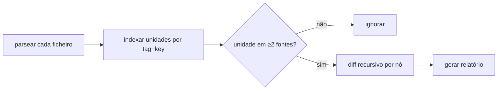

# Como funciona

O `xmldiffreport` trata cada documento XML como uma árvore de nós e compara **N**
deles ao mesmo tempo, alinhando-os por uma **chave natural** em vez da posição.

## O modelo

- Cada elemento é um nó com **atributos**, **texto** (opcional) e **filhos**.
- Uma **recipe** declara, por tag: a `key` (identidade natural), se a tag é
  `inline` (os filhos viram pseudo-atributos em vez de abrir nível) e que
  atributos ignorar.
- O motor compara **N fontes** em simultâneo, casando os nós por identidade
  (independente da ordem). **Só as diferenças** entram no resultado.

## Unidades e recursão

O `unit` da recipe (ex. `SMART_FOLDER`) é a entidade de topo. Para cada unidade
presente em **2 ou mais fontes**, o motor percorre a árvore recursivamente:

- **Diferenças escalares** — atributos (e texto) que diferem viram linhas.
- **Filhos folha / inline** (ex. `INCOND`, `OUTCOND`, `ON`) são comparados pela
  chave; surge uma linha quando um é adicionado/removido ou quando um dos seus
  **atributos** muda (ex. um `OUTCOND` mantém o `NAME` mas troca o `SIGN`).
- **Filhos contentores** (ex. `JOB`) abrem novo nível e aparecem como
  sub-secções; os idênticos são resumidos numa contagem.

## Ao nível do atributo, não só presente/ausente

Como os elementos são casados por identidade, uma mudança *dentro* de um elemento
aparece como mudança de atributo, e não como remoção + adição:

| Element · attribute | bench | uat | prod |
|---|---|---|---|
| INCOND `…STAGE-…LOAD_OK` · `AND_OR` | A | O | A |
| OUTCOND `…LOAD-…POST_OK` · `SIGN` | - | + | + |

## Atributos voláteis são ignorados

Atributos que mudam a cada export sem significado funcional — `VERSION`,
`CREATION_TIME`, `JOBISN`, `LAST_UPLOAD`, … — estão na lista `ignore_attrs` da
recipe e nunca geram linha. É isto que torna o diff *semântico* em vez de ruidoso.

## O que é reportado

O motor reporta **diferenças** — cada unidade presente em 2+ fontes que não seja
idêntica. Não entra no teu domínio: **não** classifica essas diferenças (ex.
"conflito" vs "informativo"). Se essa distinção importa no teu fluxo, deriva-a tu
a partir do resultado — sabes qual ficheiro é qual (o relatório rotula cada um
pelo caminho).

## Namespaces e texto

Os namespaces XML são removidos no parse (`{uri}tag` → `tag`) para tags e chaves
ficarem legíveis e as recipes simples. O **texto** dos elementos também é
comparável — ex. um `<url>` de sitemap é identificado pelo texto do seu `<loc>` e
o texto do `<lastmod>` é comparado como valor.
