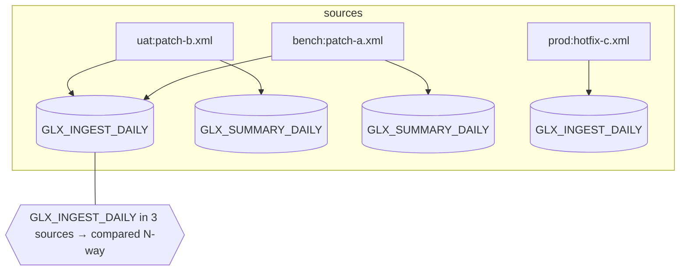

# Inputs: where your files live & how they're matched

This is the part people get wrong most often, so let's be precise. Once the
mental model clicks, everything else follows.

## The mental model (three ideas)

1. **A source is a `(environment, file)` pair.** Every XML file you point the tool
   at becomes one source, labelled `environment:filename` (e.g. `uat:patch-b.xml`).
2. **A unit is the recipe's `unit` element** (for Control-M, `SMART_FOLDER`). A
   single file may contain **many units**.
3. **Comparison happens per unit, across every source that contains it** — but
   only for units present in **2 or more sources**. A unit that appears in just
   one source is left alone (nothing to compare it against).



## The layouts you can point at

You pass **files and/or folders** as arguments. There are four practical shapes.

### 1. A parent folder of environment sub-folders  ← the common case

```text
environments/
├── test/   patch-d.xml
├── uat/    patch-b.xml   patch-e.xml
├── bench/  patch-a.xml   patch-x.xml
└── prod/   hotfix-c.xml
```

```bash
xmldiffreport environments --recipe controlm -o report.md
```

Each **sub-folder is an environment**; every `*.xml` inside it is a source. This
is what you want when you download each environment's patches into its own folder
(e.g. Jira attachments per environment).

### 2. A single folder of `.xml`

```text
uat/
├── patch-b.xml
└── patch-e.xml
```

```bash
xmldiffreport uat --recipe controlm
```

The **folder name becomes the environment** (`uat`). Useful to compare the files
*within* one environment.

### 3. Explicit files

```bash
xmldiffreport a.xml b.xml c.xml --recipe controlm
```

Each file is a source; its environment label is its parent folder's name. Handy
for ad-hoc, one-off comparisons.

### 4. Scattered locations → the usage config

When your environments are **not** under a common parent (e.g. different download
folders), use the [usage harness](usage.md): a `config.toml` maps each
environment to **any path**.

```toml
# usage/config.toml
recipe = "controlm"
report_dir = "reports"

[environments]
uat   = "/data/jira/uat-downloads"
bench = "/mnt/share/bench"
prod  = "/var/ctm/prod-applied"
```

```bash
python usage/collect.py
```

## How discovery works (the exact rules)

- A folder argument: if its sub-folders contain `*.xml`, **each sub-folder is an
  environment**; otherwise the folder itself is one environment.
- Within an environment, **all `*.xml` are read**, sorted by name. Each becomes a
  source `env:filename`.
- **Two files in the same environment are compared too** — if `uat/patch-b.xml`
  and `uat/patch-e.xml` both contain folder `X`, that's an intra-environment
  comparison.
- A file may hold **many units**; the engine indexes them all.
- Only units present in **≥ 2 sources** are diffed. Identical content across
  sources produces **no** rows (it's not a difference).
- The environment named **`prod`** (configurable via the recipe's `applied_env`
  or `--applied-env`) is the *already applied* one: overlaps with it are **INFO**,
  not conflicts.

## Worked example (end to end)

Using the synthetic dataset shipped in `examples/controlm/`:

```text
examples/controlm/
├── test/   patch-d.xml          (GLX_NIGHTLY_START, GLX_DISK_CHECK)
├── uat/    patch-b.xml          (GLX_INGEST_DAILY, GLX_SUMMARY_DAILY, GLX_LEDGER_DAILY)
│           patch-e.xml          (GLX_RISK_SCAN)
├── bench/  patch-a.xml          (GLX_INGEST_DAILY, GLX_SUMMARY_DAILY, GLX_PRICING_DAILY, GLX_LEDGER_DAILY)
│           patch-x.xml          (GLX_RISK_SCAN)
└── prod/   hotfix-c.xml         (GLX_INGEST_DAILY, GLX_PRICING_DAILY)
```

```bash
xmldiffreport examples/controlm --recipe controlm -o report.md
```

→ `4 environments · 6 files · 5 units with differences · 4 conflicts`. The
report's summary:

| Unit | Classification | Sources | Why |
|---|---|---|---|
| `GLX_INGEST_DAILY` | ⚠️ CONFLICT | 3 | in uat **and** bench (both pending) — and also prod |
| `GLX_SUMMARY_DAILY` | ⚠️ CONFLICT | 2 | in uat and bench, differ at folder level |
| `GLX_LEDGER_DAILY` | ⚠️ CONFLICT | 2 | in uat and bench, folder + a shared job |
| `GLX_PRICING_DAILY` | ℹ️ INFO | 2 | only pending side is bench; the other is **prod** |
| `GLX_RISK_SCAN` | ⚠️ CONFLICT | 2 | `uat:patch-e` ↔ `bench:patch-x`, one extra INCOND |

`GLX_NIGHTLY_START` and `GLX_DISK_CHECK` exist only in `test` → single source →
not reported.

## Gotchas (read this if a result surprises you)

- **“My folder doesn't show up.”** It's present in only one source. You need the
  *same* unit in ≥ 2 sources to get a comparison.
- **“Two identical copies, no conflict.”** Correct — identical content (ignoring
  volatile attributes) is not a difference.
- **“Same folder twice in one environment.”** That's an intra-environment
  conflict and *is* reported (two files in `uat/` touching folder `X`).
- **“Everything vs prod is INFO.”** By design: `prod` is the applied baseline.
  Override the applied env with `--applied-env NAME` (or `applied_env` in the
  recipe) if your pipeline names it differently.
- **Large files:** each file is parsed into memory; fine up to tens of MB. See
  **Performance & scale** below.

## Performance & scale

The cost model is simple: **parse every file → index units by `(tag, key)` →
deep-compare only the units present in ≥ 2 sources.** Time is roughly linear in
total input; the **report size tracks the changes, not the input**.

Measured on synthetic data (Apple silicon, Python 3.14):

| Input | Folders | Jobs | Time | Peak RSS |
|---|---|---|---|---|
| 17 files, sparse overlap | 438 | ~1.3k | 0.05 s | 26 MB |
| 2 × 2.8 MB | 16 000 | 80 000 | 0.35 s | 75 MB |
| 2 × 7.3 MB | 40 000 | 200 000 | 0.83 s | 153 MB |

Rules of thumb:

- **Time** scales linearly — ~7 MB diffs in well under a second.
- **Memory** is the ceiling: roughly **~10× the total XML bytes**, because every
  parsed tree is held at once to find overlaps. It sums across *all* files, not
  just the largest. Comfortable to **tens of MB**; not designed for gigabytes.
- **N-way width:** a unit found in *K* sources renders a *K*-column table — only
  the sources that contain that unit, never all N. Very wide tables (many sources
  on one unit) read better in the **HTML** format.
- **Many files, sparse overlap** (the common case): all files are parsed, but only
  the units that appear in ≥ 2 sources are reported — the rest are ignored
  cheaply. 17 files where only 3 folder names overlap → a 3-row report.
