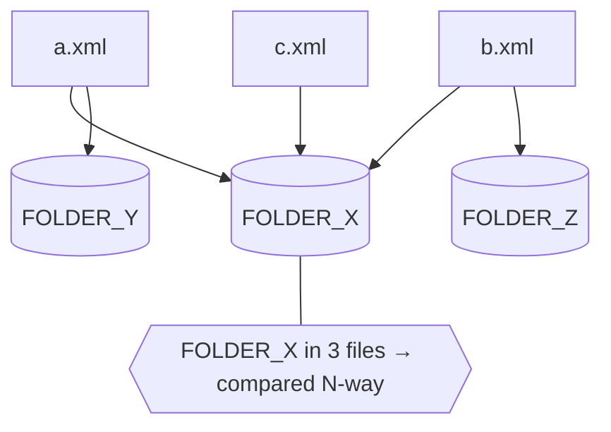

# Inputs: where your files live & how they're matched

The tool is deliberately simple about input: you give it **files and/or
directories**. There is no "environment" concept — a file is a file.

## The mental model (three ideas)

1. **Every file is a source.** Each XML you point at becomes one source, labelled
   by its **file path**.
2. **A unit is the recipe's `unit` element** (for Control-M, `SMART_FOLDER`). A
   single file may contain **many units**.
3. **Comparison happens per unit, across every source that contains it** — but
   only for units present in **2 or more sources**. A unit that appears in just
   one file is left alone (nothing to compare it against).



## The layouts you can point at

### 1. Two (or more) files

```bash
xmldiffreport old.xml new.xml -o report.md
xmldiffreport v1.xml v2.xml v3.xml -o report.md       # as many as you like
```

### 2. A directory (scanned recursively)

```bash
xmldiffreport ./dump -o report.md      # every *.xml under ./dump becomes a source
```

### 3. A mix of files and directories

```bash
xmldiffreport baseline.xml ./candidates -o report.md
```

### 4. From a config (the usage harness)

When you'd rather keep the paths and output settings in a file, use the
[usage harness](usage.md): a `config.toml` with an `inputs` list (files and/or
dirs).

```toml
# usage/config.toml
recipe = "controlm"
report_dir = "reports"
inputs = ["/data/ctm/uat", "/data/ctm/bench", "/data/ctm/prod"]
```

```bash
python usage/collect.py
```

## How discovery works (the exact rules)

- A **file** argument is taken as-is.
- A **directory** argument is scanned **recursively** for `*.xml`; each match is a
  source. Pass several directories and they all contribute.
- Every source is labelled by its **file path** — that's the column header in the
  report. (If it matters which file is production, name it accordingly.)
- A file may hold **many units**; the engine indexes them all.
- Only units present in **≥ 2 sources** are diffed. Identical content across
  sources produces **no** rows (it's not a difference).

## Worked example (end to end)

The synthetic dataset shipped in `examples/controlm/` is just a tree of XML files:

```text
examples/controlm/
├── test/   patch-d.xml          (GLX_NIGHTLY_START, GLX_DISK_CHECK)
├── uat/    patch-b.xml          (GLX_INGEST_DAILY, GLX_SUMMARY_DAILY, GLX_LEDGER_DAILY)
│           patch-e.xml          (GLX_RISK_SCAN)
├── bench/  patch-a.xml          (GLX_INGEST_DAILY, GLX_SUMMARY_DAILY, GLX_PRICING_DAILY, GLX_LEDGER_DAILY)
│           patch-x.xml          (GLX_RISK_SCAN)
└── prod/   hotfix-c.xml         (GLX_INGEST_DAILY, GLX_PRICING_DAILY)
```

```bash
xmldiffreport examples/controlm --recipe controlm -o report.md
```

→ `5 unit(s) with differences across 6 file(s)`. The report's summary:

| Unit | In how many files | Why |
|---|---|---|
| `GLX_INGEST_DAILY` | 3 | present in `bench/patch-a`, `uat/patch-b`, `prod/hotfix-c` and differs |
| `GLX_SUMMARY_DAILY` | 2 | in `uat/patch-b` and `bench/patch-a`, differ at folder level |
| `GLX_LEDGER_DAILY` | 2 | in `uat/patch-b` and `bench/patch-a`, folder + a shared job |
| `GLX_PRICING_DAILY` | 2 | in `bench/patch-a` and `prod/hotfix-c`, a job differs |
| `GLX_RISK_SCAN` | 2 | in `uat/patch-e` and `bench/patch-x`, one extra INCOND |

`GLX_NIGHTLY_START` and `GLX_DISK_CHECK` exist in only one file → not reported.

## Gotchas (read this if a result surprises you)

- **“My unit doesn't show up.”** It's present in only one file. You need the
  *same* unit in ≥ 2 files to get a comparison.
- **“Two identical copies, nothing reported.”** Correct — identical content
  (ignoring volatile attributes) is not a difference.
- **Large files:** each file is parsed into memory; fine up to tens of MB. See
  **Performance & scale** below.

## Performance & scale

The cost model is simple: **parse every file → index units by `(tag, key)` →
deep-compare only the units present in ≥ 2 sources.** Time is roughly linear in
total input; the **report size tracks the changes, not the input**.

Measured on synthetic data (Apple silicon, Python 3.14):

| Input | Folders | Jobs | Time | Peak RSS |
|---|---|---|---|---|
| 17 files, little overlap | 438 | ~1.3k | 0.05 s | 26 MB |
| 2 × 2.8 MB | 16 000 | 80 000 | 0.35 s | 75 MB |
| 2 × 7.3 MB | 40 000 | 200 000 | 0.83 s | 153 MB |

Rules of thumb:

- **Time** scales linearly — ~7 MB diffs in well under a second.
- **Memory** is the ceiling: roughly **~10× the total XML bytes**, because every
  parsed tree is held at once to find overlaps. It sums across *all* files, not
  just the largest. Comfortable to **tens of MB**; not designed for gigabytes.
- **N-way width:** a unit found in *K* files renders a *K*-column table — only the
  files that contain that unit. Very wide tables read better as **HTML**.
- **Many files, little overlap:** all files are parsed, but only the units that
  appear in ≥ 2 files are reported — the rest are ignored cheaply. 17 files where
  only 3 unit names overlap → a 3-row report.
