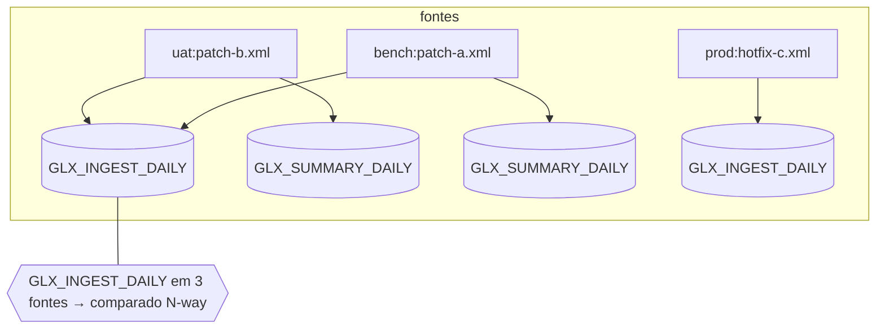

# Inputs: onde estão os ficheiros e como são casados

É a parte que mais se erra, por isso vamos ser precisos. Quando o modelo mental
assenta, o resto sai sozinho.

## O modelo mental (três ideias)

1. **Uma fonte é um par `(ambiente, ficheiro)`.** Cada XML a que apontas vira uma
   fonte, com rótulo `ambiente:ficheiro` (ex. `uat:patch-b.xml`).
2. **Uma unidade é o elemento `unit` da recipe** (no Control-M, `SMART_FOLDER`). Um
   ficheiro pode conter **muitas unidades**.
3. **A comparação é por unidade, entre todas as fontes que a contêm** — mas só
   para unidades presentes em **2 ou mais fontes**. Uma unidade que aparece numa só
   fonte fica de fora (não há com o quê comparar).



## Os layouts que podes usar

Passas **ficheiros e/ou pastas** como argumentos. Há quatro formas práticas.

### 1. Uma pasta-pai com subpastas de ambiente  ← o caso comum

```text
environments/
├── test/   patch-d.xml
├── uat/    patch-b.xml   patch-e.xml
├── bench/  patch-a.xml   patch-x.xml
└── prod/   hotfix-c.xml
```

```bash
xmldiffreport environments --recipe controlm -o report.md
```

Cada **subpasta é um ambiente**; cada `*.xml` lá dentro é uma fonte. É o que
queres quando descarregas os patches de cada ambiente para a sua pasta (ex. anexos
do Jira por ambiente).

### 2. Uma só pasta de `.xml`

```text
uat/
├── patch-b.xml
└── patch-e.xml
```

```bash
xmldiffreport uat --recipe controlm
```

O **nome da pasta vira o ambiente** (`uat`). Útil para comparar os ficheiros
*dentro* de um ambiente.

### 3. Ficheiros explícitos

```bash
xmldiffreport a.xml b.xml c.xml --recipe controlm
```

Cada ficheiro é uma fonte; o rótulo de ambiente é o nome da pasta-mãe. Bom para
comparações pontuais.

### 4. Locais dispersos → o config de uso

Quando os ambientes **não** estão sob uma pasta-pai comum (ex. pastas de download
diferentes), usa o [harness de uso](usage.md): um `config.toml` mapeia cada
ambiente a **qualquer caminho**.

```toml
# usage/config.toml
recipe = "controlm"
report_dir = "reports"

[environments]
uat   = "/data/jira/uat-downloads"
bench = "/mnt/share/bench"
prod  = "/var/ctm/prod-applied"
```

```bash
python usage/collect.py
```

## Como funciona a descoberta (as regras exatas)

- Argumento que é pasta: se as subpastas contêm `*.xml`, **cada subpasta é um
  ambiente**; senão a própria pasta é um ambiente.
- Dentro de um ambiente, **todos os `*.xml` são lidos**, ordenados por nome. Cada
  um vira uma fonte `ambiente:ficheiro`.
- **Dois ficheiros no mesmo ambiente também são comparados** — se
  `uat/patch-b.xml` e `uat/patch-e.xml` contiverem ambos o folder `X`, é uma
  comparação intra-ambiente.
- Um ficheiro pode ter **muitas unidades**; o motor indexa-as todas.
- Só unidades em **≥ 2 fontes** são comparadas. Conteúdo idêntico entre fontes não
  gera linhas (não é diferença).
- O ambiente chamado **`prod`** (configurável via `applied_env` da recipe ou
  `--applied-env`) é o *já aplicado*: sobreposições com ele dão **INFO**, não
  conflito.

## Exemplo completo (ponta a ponta)

Com o dataset sintético em `examples/controlm/`:

```text
examples/controlm/
├── test/   patch-d.xml          (GLX_NIGHTLY_START, GLX_DISK_CHECK)
├── uat/    patch-b.xml          (GLX_INGEST_DAILY, GLX_SUMMARY_DAILY, GLX_LEDGER_DAILY)
│           patch-e.xml          (GLX_RISK_SCAN)
├── bench/  patch-a.xml          (GLX_INGEST_DAILY, GLX_SUMMARY_DAILY, GLX_PRICING_DAILY, GLX_LEDGER_DAILY)
│           patch-x.xml          (GLX_RISK_SCAN)
└── prod/   hotfix-c.xml         (GLX_INGEST_DAILY, GLX_PRICING_DAILY)
```

```bash
xmldiffreport examples/controlm --recipe controlm -o report.md
```

→ `4 ambientes · 6 ficheiros · 5 unidades com diferenças · 4 conflitos`. O resumo
do relatório:

| Unidade | Classificação | Fontes | Porquê |
|---|---|---|---|
| `GLX_INGEST_DAILY` | ⚠️ CONFLICT | 3 | em uat **e** bench (ambos pendentes) — e também prod |
| `GLX_SUMMARY_DAILY` | ⚠️ CONFLICT | 2 | em uat e bench, diferem ao nível do folder |
| `GLX_LEDGER_DAILY` | ⚠️ CONFLICT | 2 | em uat e bench, folder + um job em comum |
| `GLX_PRICING_DAILY` | ℹ️ INFO | 2 | o único lado pendente é bench; o outro é **prod** |
| `GLX_RISK_SCAN` | ⚠️ CONFLICT | 2 | `uat:patch-e` ↔ `bench:patch-x`, uma INCOND a mais |

`GLX_NIGHTLY_START` e `GLX_DISK_CHECK` só existem em `test` → fonte única → não são
reportados.

## Armadilhas (lê isto se um resultado te surpreender)

- **“O meu folder não aparece.”** Está só numa fonte. Precisas da *mesma* unidade
  em ≥ 2 fontes para haver comparação.
- **“Duas cópias idênticas, sem conflito.”** Correto — conteúdo idêntico (ignorando
  voláteis) não é diferença.
- **“O mesmo folder duas vezes num ambiente.”** É um conflito intra-ambiente e *é*
  reportado (dois ficheiros em `uat/` a tocar no folder `X`).
- **“Tudo vs prod dá INFO.”** É de propósito: `prod` é o baseline aplicado. Muda o
  ambiente aplicado com `--applied-env NOME` (ou `applied_env` na recipe) se o teu
  pipeline lhe chamar outra coisa.
- **Ficheiros grandes:** cada ficheiro é parseado em memória; bom até dezenas de
  MB. Ver **Performance & escala** abaixo.

## Performance & escala

O modelo de custo é simples: **parsear todos os ficheiros → indexar unidades por
`(tag, key)` → comparar a fundo só as unidades presentes em ≥ 2 fontes.** O tempo
é ~linear no total de entrada; o **tamanho do relatório segue as mudanças, não a
entrada**.

Medido em dados sintéticos (Apple silicon, Python 3.14):

| Entrada | Folders | Jobs | Tempo | RSS máx |
|---|---|---|---|---|
| 17 ficheiros, sobreposição esparsa | 438 | ~1.3k | 0,05 s | 26 MB |
| 2 × 2,8 MB | 16 000 | 80 000 | 0,35 s | 75 MB |
| 2 × 7,3 MB | 40 000 | 200 000 | 0,83 s | 153 MB |

Regras de bolso:

- **Tempo** escala linearmente — ~7 MB diffam bem abaixo de um segundo.
- **Memória** é o teto: cerca de **~10× o total de bytes XML**, porque todas as
  árvores ficam em memória ao mesmo tempo para achar as sobreposições. Soma entre
  *todos* os ficheiros, não só o maior. Confortável até **dezenas de MB**; não
  desenhado para gigabytes.
- **Largura N-way:** uma unidade em *K* fontes gera uma tabela de *K* colunas —
  só as fontes que a contêm, nunca as N. Tabelas muito largas (muitas fontes numa
  unidade) leem-se melhor no formato **HTML**.
- **Muitos ficheiros, sobreposição esparsa** (o caso comum): todos os ficheiros
  são parseados, mas só as unidades em ≥ 2 fontes são reportadas — as restantes
  são ignoradas barato. 17 ficheiros com só 3 nomes de folder em comum → relatório
  de 3 linhas.
