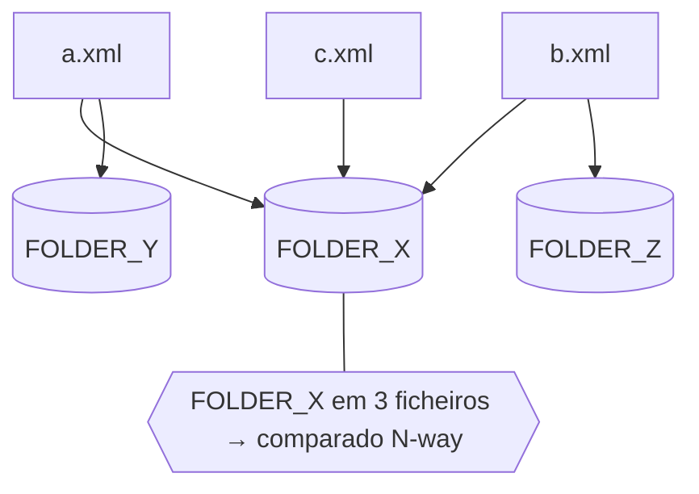

# Inputs: onde estão os ficheiros e como são casados

A ferramenta é propositadamente simples quanto à entrada: dás-lhe **ficheiros
e/ou diretórios**. Não há conceito de "ambiente" — um ficheiro é um ficheiro.

## O modelo mental (três ideias)

1. **Cada ficheiro é uma fonte.** Cada XML a que apontas vira uma fonte, com
   rótulo igual ao **caminho do ficheiro**.
2. **Uma unidade é o elemento `unit` da recipe** (no Control-M, `SMART_FOLDER`). Um
   ficheiro pode conter **muitas unidades**.
3. **A comparação é por unidade, entre todas as fontes que a contêm** — mas só
   para unidades presentes em **2 ou mais fontes**. Uma unidade que aparece num só
   ficheiro fica de fora (não há com o quê comparar).



## Os layouts que podes usar

### 1. Dois (ou mais) ficheiros

```bash
xmldiffreport old.xml new.xml -o report.md
xmldiffreport v1.xml v2.xml v3.xml -o report.md       # quantos quiseres
```

### 2. Um diretório (varrido recursivamente)

```bash
xmldiffreport ./dump -o report.md      # cada *.xml sob ./dump vira uma fonte
```

### 3. Mistura de ficheiros e diretórios

```bash
xmldiffreport baseline.xml ./candidatos -o report.md
```

### 4. A partir de um config (o harness de uso)

Quando preferes guardar os caminhos e as opções num ficheiro, usa o
[harness de uso](usage.md): um `config.toml` com uma lista `inputs` (ficheiros
e/ou dirs).

```toml
# usage/config.toml
recipe = "controlm"
report_dir = "reports"
inputs = ["/data/ctm/uat", "/data/ctm/bench", "/data/ctm/prod"]
```

```bash
python usage/collect.py
```

## Como funciona a descoberta (as regras exatas)

- Um argumento que é **ficheiro** é usado tal e qual.
- Um argumento que é **diretório** é varrido **recursivamente** por `*.xml`; cada
  resultado é uma fonte. Passa vários diretórios e todos contribuem.
- Cada fonte é rotulada pelo seu **caminho** — é o cabeçalho da coluna no
  relatório. (Se importa qual ficheiro é produção, dá-lhe um nome que o diga.)
- Um ficheiro pode ter **muitas unidades**; o motor indexa-as todas.
- Só unidades em **≥ 2 fontes** são comparadas. Conteúdo idêntico entre fontes não
  gera linhas (não é diferença).

## Exemplo completo (ponta a ponta)

O dataset sintético em `examples/controlm/` é só uma árvore de ficheiros XML:

```text
examples/controlm/
├── test/   patch-d.xml          (GLX_NIGHTLY_START, GLX_DISK_CHECK)
├── uat/    patch-b.xml          (GLX_INGEST_DAILY, GLX_SUMMARY_DAILY, GLX_LEDGER_DAILY)
│           patch-e.xml          (GLX_RISK_SCAN)
├── bench/  patch-a.xml          (GLX_INGEST_DAILY, GLX_SUMMARY_DAILY, GLX_PRICING_DAILY, GLX_LEDGER_DAILY)
│           patch-x.xml          (GLX_RISK_SCAN)
└── prod/   hotfix-c.xml         (GLX_INGEST_DAILY, GLX_PRICING_DAILY)
```

```bash
xmldiffreport examples/controlm --recipe controlm -o report.md
```

→ `5 unit(s) with differences across 6 file(s)`. O resumo do relatório:

| Unidade | Em quantos ficheiros | Porquê |
|---|---|---|
| `GLX_INGEST_DAILY` | 3 | em `bench/patch-a`, `uat/patch-b`, `prod/hotfix-c` e difere |
| `GLX_SUMMARY_DAILY` | 2 | em `uat/patch-b` e `bench/patch-a`, diferem ao nível do folder |
| `GLX_LEDGER_DAILY` | 2 | em `uat/patch-b` e `bench/patch-a`, folder + um job em comum |
| `GLX_PRICING_DAILY` | 2 | em `bench/patch-a` e `prod/hotfix-c`, um job difere |
| `GLX_RISK_SCAN` | 2 | em `uat/patch-e` e `bench/patch-x`, uma INCOND a mais |

`GLX_NIGHTLY_START` e `GLX_DISK_CHECK` só existem num ficheiro → não são reportados.

## Armadilhas (lê isto se um resultado te surpreender)

- **“A minha unidade não aparece.”** Está só num ficheiro. Precisas da *mesma*
  unidade em ≥ 2 ficheiros para haver comparação.
- **“Duas cópias idênticas, nada reportado.”** Correto — conteúdo idêntico
  (ignorando voláteis) não é diferença.
- **Ficheiros grandes:** cada ficheiro é parseado em memória; bom até dezenas de
  MB. Ver **Performance & escala** abaixo.

## Performance & escala

O modelo de custo é simples: **parsear todos os ficheiros → indexar unidades por
`(tag, key)` → comparar a fundo só as unidades presentes em ≥ 2 fontes.** O tempo
é ~linear no total de entrada; o **tamanho do relatório segue as mudanças, não a
entrada**.

Medido em dados sintéticos (Apple silicon, Python 3.14):

| Entrada | Folders | Jobs | Tempo | RSS máx |
|---|---|---|---|---|
| 17 ficheiros, pouca sobreposição | 438 | ~1.3k | 0,05 s | 26 MB |
| 2 × 2,8 MB | 16 000 | 80 000 | 0,35 s | 75 MB |
| 2 × 7,3 MB | 40 000 | 200 000 | 0,83 s | 153 MB |

Regras de bolso:

- **Tempo** escala linearmente — ~7 MB diffam bem abaixo de um segundo.
- **Memória** é o teto: cerca de **~10× o total de bytes XML**, porque todas as
  árvores ficam em memória ao mesmo tempo para achar as sobreposições. Soma entre
  *todos* os ficheiros, não só o maior. Confortável até **dezenas de MB**; não
  desenhado para gigabytes.
- **Largura N-way:** uma unidade em *K* ficheiros gera uma tabela de *K* colunas —
  só os ficheiros que a contêm. Tabelas muito largas leem-se melhor em **HTML**.
- **Muitos ficheiros, pouca sobreposição:** todos são parseados, mas só as
  unidades em ≥ 2 ficheiros são reportadas — as restantes são ignoradas barato. 17
  ficheiros com só 3 nomes de unidade em comum → relatório de 3 linhas.
